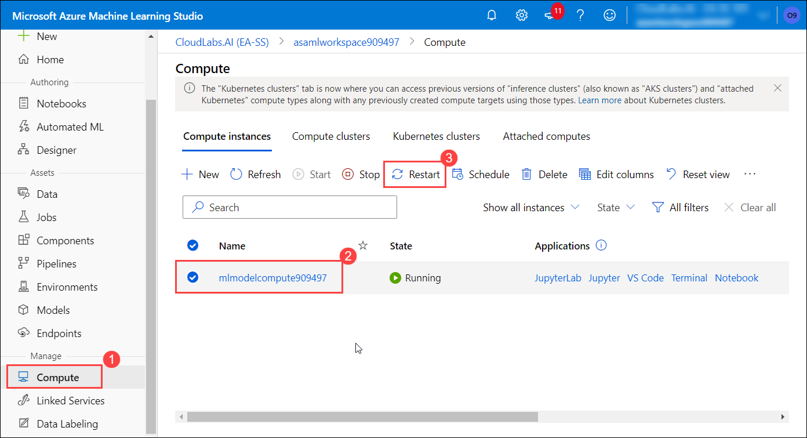
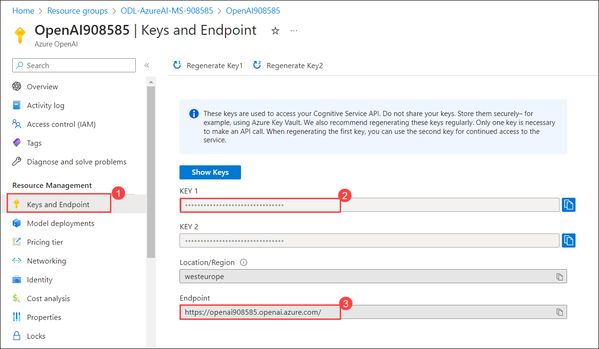
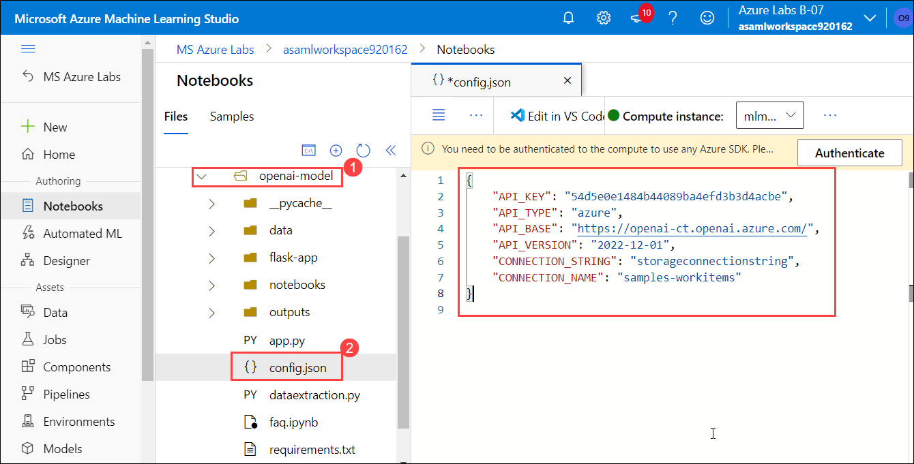
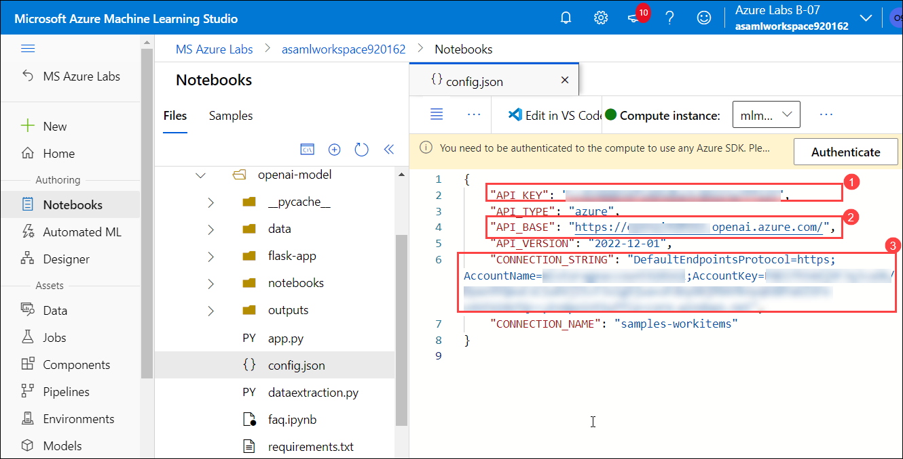
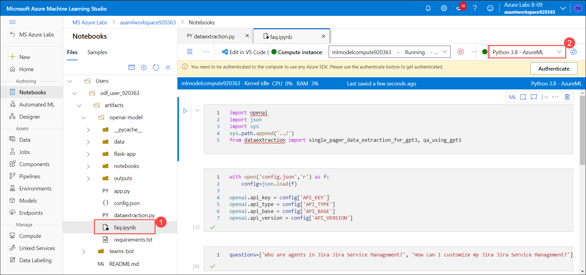

## Exercise 1: Leveraging an OpenAI model to create extract data and create embeddings

In this exercise, you will be installing the required packages from the Machine learning studio. You will also be deploying the Model in Open AI by running the Python notebook from the Machine learning studio

### Task 1: Install all the required libraries using the requirements.txt file


1. In Azure Portal, click on **Resource groups** from the Navigate panel.

   

1. From the Resource groups page, click on **ODL-AzureAI-MS-<inject key="DeploymentID" enableCopy="false"/>**.

   

1. From the **Overview (1)** tab select the Azure Machine Learning workspace **asamlworkspace<inject key="DeploymentID" enableCopy="false"/> (2)**.

   
   
1. On Azure Machine Learning workspace click on **Launch studio**.

   

1. On Microsoft Azure Machine Learning Studio Click on **Notebooks (1)** and click on **Open Terminal (2)** and run the below-mentioned commands

    ```
    cd artifacts/openai-model
    ```
    
    ```
    pip install --upgrade -r requirements.txt
    ```
    
    ```
    pip install --upgrade pip
    ```
    
    ```
    pip install numpy==1.23.5
    ```
    
    
    
    

1. Now you need to restart the compute instance after installing the required packages. Follow the below steps to restart the compute instance:

   -  Select **Compute (1)** under Manage
   -  Choose the pre-deployed compute instance **mlmodelcompute<inject key="DeploymentID" enableCopy="false"/> (2)**
   -  Click on **Restart (3)**

   
   
### Task 2: Update the configuration file with newly generated credentials

1. Navigate back to the Azure Portal and from the **Overview (1)** page of the resource group select Azure Open AI **OpenAI<inject key="DeploymentID" enableCopy="false"/> (2)**.

    
    
1. Click on **Keys and Endpoints (1)** and copy the values of **Key 1 (2)** and **Endpoint (3)** in a Notepad. You will be using these values in the next steps.

   
   
1. Navigate to Azure Machine Learning Studio and expand **Openai-model (1)** folder then click on **config.json (2)**.

   
   
1. Follow the below instructions to replace the values:

   - **API_KEY**: Enter the value of **Key (1)** of Open AI you have copied in step-2
   - **API_BASE**: Enter the value of **Endpoint (2)** of Open AI you have copied in step-2
   - **CONNECTION_STRING**: Enter the value **<inject key="StorageAccountConnectionString" enableCopy="true"/> (3)**

   
   
1. Select on **eclipse (1)** and click on **Save (2)**.

   
   
### Task 3: Experiment with notebooks to explore data and model


1. Navigate to the **notebooks** folder, open **dataextraction.py** file from the path **User/ode_user_<inject key="DeploymentID" enableCopy="false"/>/artifacts/openai-model**

    

1. Select on the eclipse **(...)** **(1)** and click on **Save and run script in terminal (2)**.

   
    
   > **Info:** This will open a  new terminal window and will run the file. 
  
3. Navigate back to the **openai-model** folder, select **faq.ipynb (1)** file and select the kernal as **Python 3.8-Azureml (2)**.

   
   
1. Run each cell one after the other and observe the output.

   

### Task 4: Review all the modules


1. Navigate back to the Azure Portal and from the **Overview (1)** page of the resource group select Azure Open AI **OpenAI<inject key="DeploymentID" enableCopy="false"/> (2)**.

    
    
1. Click on **Model deployments (1)** and review the deployment models **(2)**.

    
    

 ## Summary

* In this exercise, you have installed the required packages from the Machine learning studio and deployed the Model in Open AI by running the Python notebook from the Machine learning studio.

