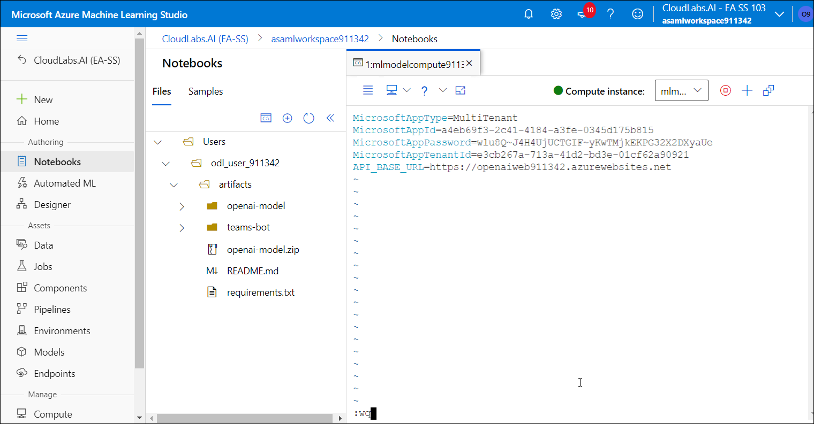

## Lab 3. Deploying the chatbot on Azure Bot Service and Azure App Service.


### Task 1 : Explore the chatbot codebase to understand user journey and dialogue development

1. Navigate back to the Azure machine learning studio, and open a new terminal session.

   
   
1. Run the below commands in the terminal session:

   ```
   cd artifacts/teams-bot
   ```
   
   ```
   vim .env
   ```
   
   

1. Now you will navigating to the editor window, press **i** to get into the **insert mode**.

   
    
1. Replace the values in the **.env** file then click on **esc** followed by **:wq**.

    
    
1. 


### Task 2 : Update the configuration file with newly generated credentials

### Task 3 : Deploy the chatbot on Azure Bot Service and Azure App Service


### Task 4: Publish the chatbot on Microsoft Teams channel using a manifest file
