## Exercise 3. Deploying the chatbot on Azure Bot Service and Azure App Service.

   In this exercise, you will be deploying the botcode to app service and will be connecting it to the Azure Bot, later you will be integrating it will MS team.
    
### Task 1 : Explore the chatbot codebase to understand user journey and dialogue development

1. You can explore the chatbot codebase under teams-bot directory. There have multiple directory and .env files that we will be updating while performing the lab.
 
    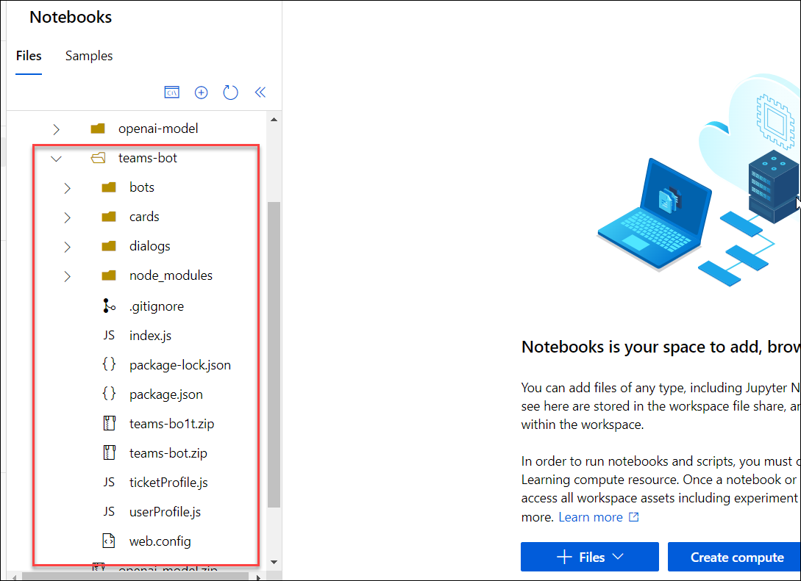

1. You can also expand the bot folder and you can go through the code for dialog bot and understand how it is working.

    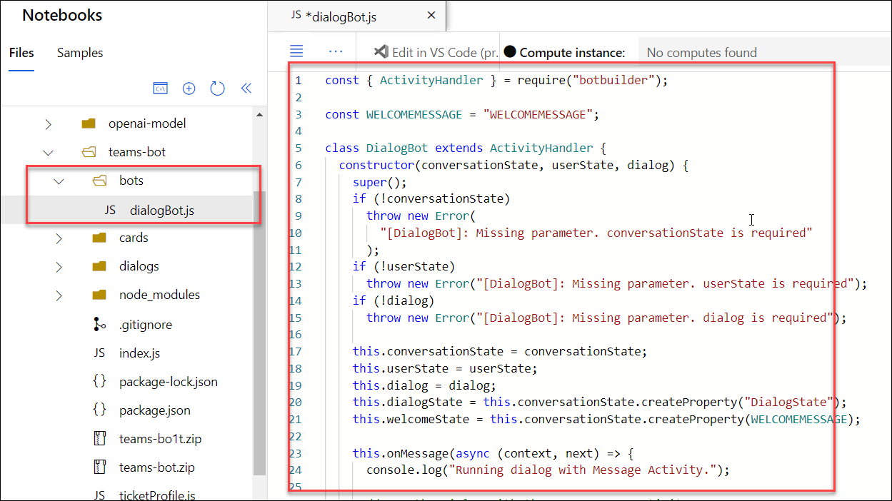
    
1. You can also review the code under dialogs and undestand the flow.

    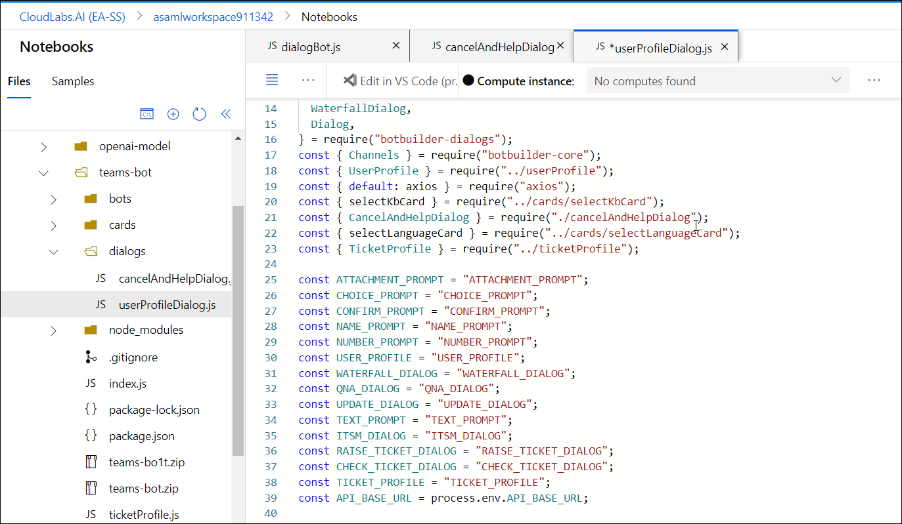

### Task 2 : Update the configuration file with newly generated credentials


1. Navigate back to the Visual studio code and follow the below instructions to update the values in .env file.

    - Click on **Explorer (1)**
    - Expand **Code[Azure ML : MLModelCompute<inject key="DeploymentID" enableCopy="false"/>] (2)**
    - Expand **Users/odl_user_<inject key="DeploymentID" enableCopy="false"/> (3)**
    - Select **.env (4)** file.

    
       

1. Replace the values in the **.env** file, you can obtaining the values from **Environment Details (1)** page, under **Service Principal Details (2)**. 

     - **MicrosoftAppId**= **Application Id (3)**
     - **MicrosoftAppPassword**= **Secret Key (4)**
     - **MicrosoftAppTenantId**= **Tenant Id (Directory id) (5)** 
     - **API_BASE_URL**= **https://openaiwebapp<inject key="DeploymentID" enableCopy="false"/>.azurewebsites.net**

          

1. After updating the values,save the file by clicking **ctrl + S**

     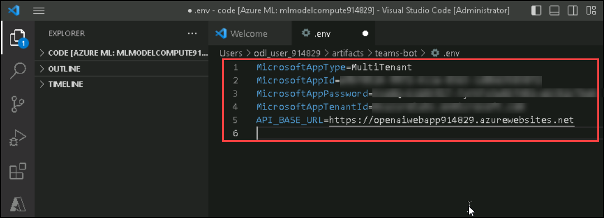    

### Task 3 : Deploy the chatbot on Azure Bot Service and Azure App Service

1. Within the terminal window run the below mentioned command to create zip folder.

   ```
   zip -r teams-bot.zip .
   ```
   > **Note :** Wait for 15-20 min till the command run successfully.

1. Now, run the below command after updating the `<DID>` with the value **<inject key="DeploymentID" enableCopy="false"/>**.

   ```
   az webapp deploy --resource-group ODL-AzureAI-MS-<DID> --name openaiteamsapp<DID> --src-path teams-bot.zip --type zip
   ```
   
1. After running the command successfully, copy the app URL in a notepad. You will be using it in coming tasks.

   
   

### Task 4: Publish the chatbot on Microsoft Teams channel using a manifest file

1. Navigate back to Azure portal and from the Overview page of resource group select Azure Bot **openai-bot-<inject key="DeploymentID" enableCopy="false"/>**.

    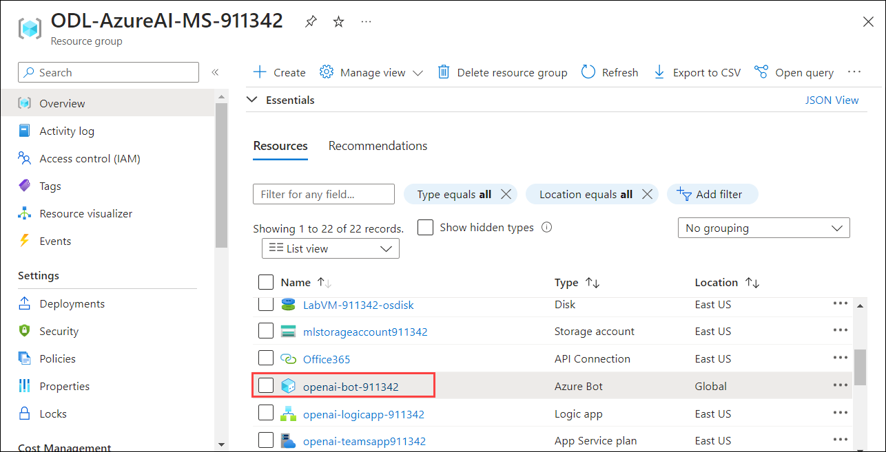
    
1. On Azure bot page, follow the below given instructions:

    - Click on  **Configuration (1)**
    - Message endpoint : Enter **https://openaiteamsapp<inject key="DeploymentID" enableCopy="false"/>.azurewebsites.net/api/messages**
    - Click on **Apply (3)**

    

1. Click on **Channels (1)** and scroll down to Available channels and select **Microsoft Teams (2)**.

    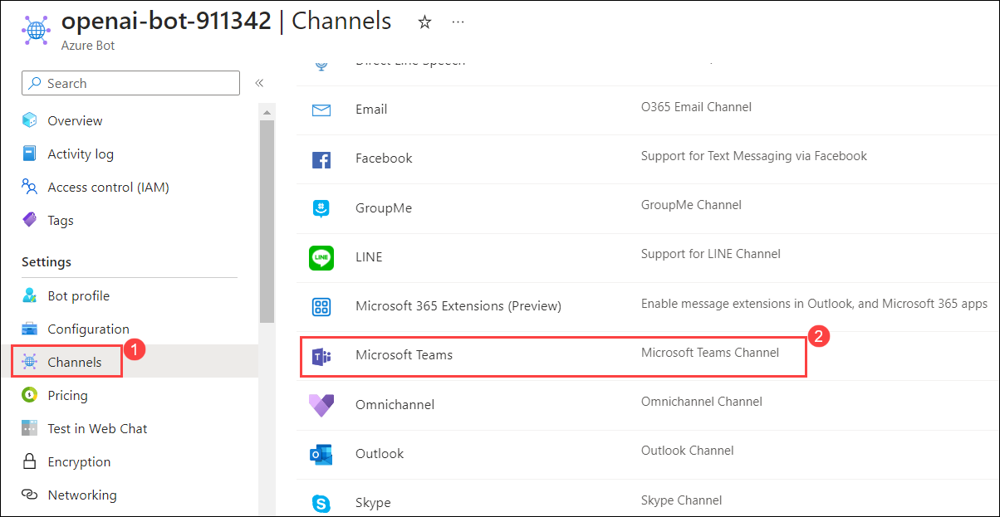
    
1. Check the box next to **I agree to the Microsoft Channel Publication Terms and the Microsoft Privacy Statements for my deployment to the Microsoft Teams channels** and click on  **Agree (2)**.

    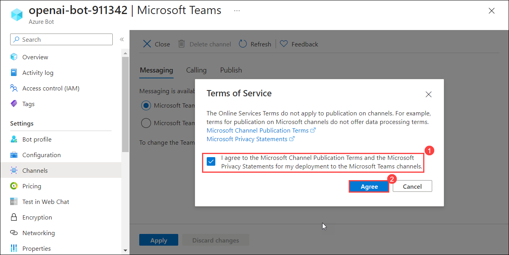
    
1. Leave eveything as default on the Microsoft Teams page and click on **Apply**.

    
    
1. Once the changes are applied succesfully, click on **Close**.

    
    
1. You can view the Microsoft Teams under Channels. Now click on **Open in Teams** URL to open the application.

    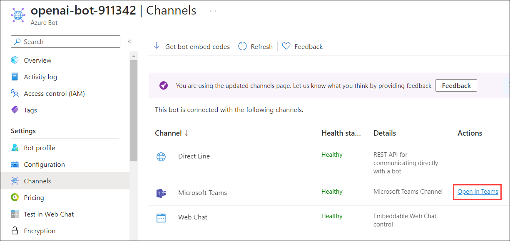
    
1. On **Microsoft Teams** window, select **Use web app instead**.

    
    
1. Send a message **Hi** in the chat **Openai-bot-<inject key="DeploymentID" enableCopy="false"/>**, you will see a response from chat bot and explore through the availble chat bot options.

    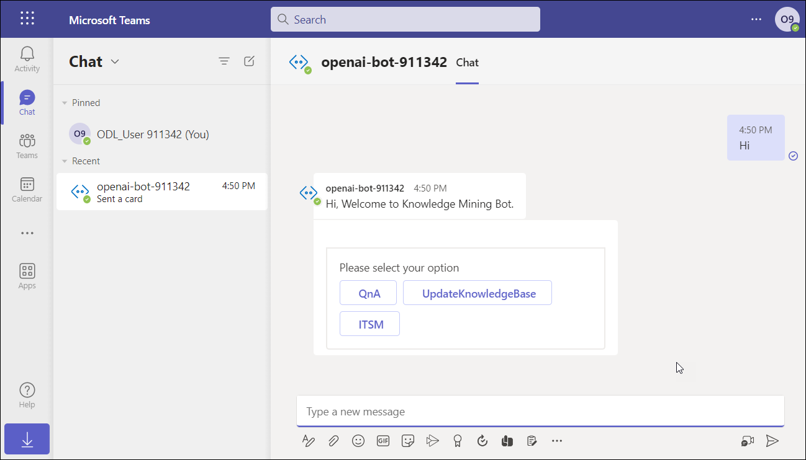

1. Select **ITSM** option to raise a ticket for any of your own queries.

   
    
1. Now click on **Raise Ticket** and enter the query.

    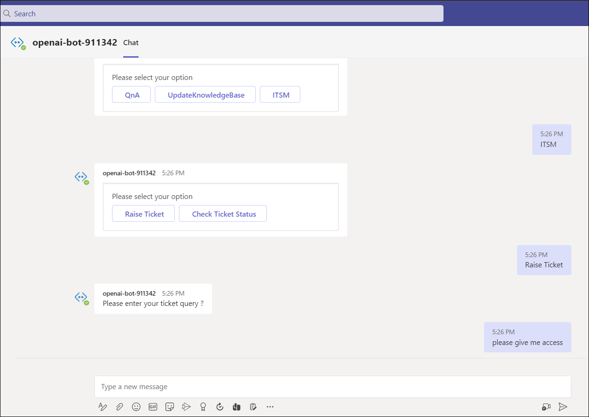
  
1. To check the status of the ticket click on **Check Ticket Status**.

    

1. Now choose **QnA** option on the teams chat.

    
    
1. On **Select knowledge base from below** tab, choose the **jira-faq (1)** document and click on **Submit (2)**.

    
    
1. Enter the below query and review the reply provided by the bot.

    ```
    Who are agents in Jira Jira Service Management?
    ```
    
    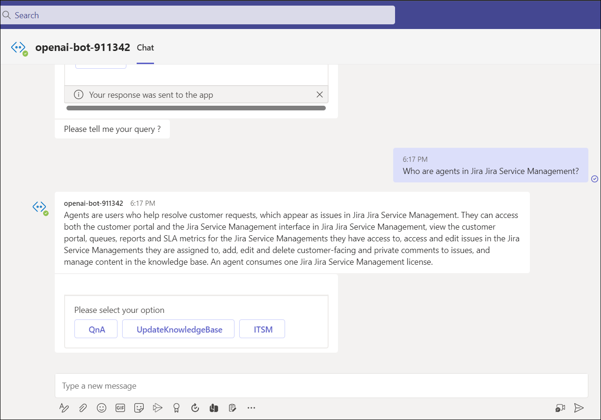
    
1. If you want to restart the bot, enter **Restart** and hit enter.

    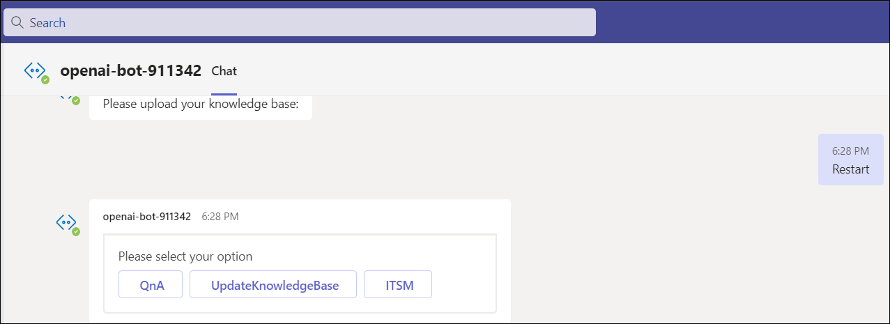
