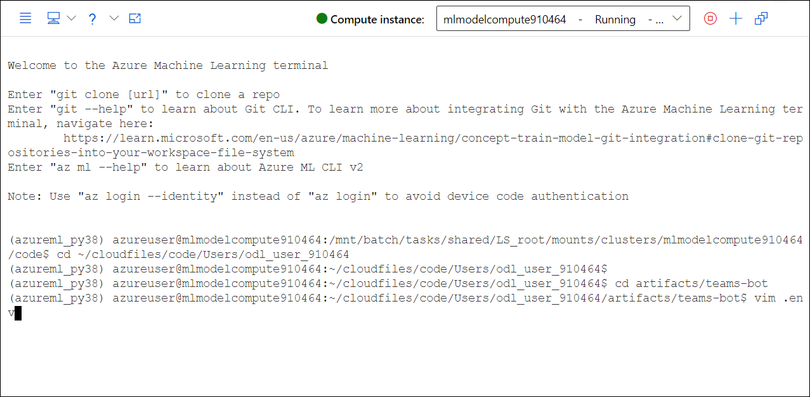
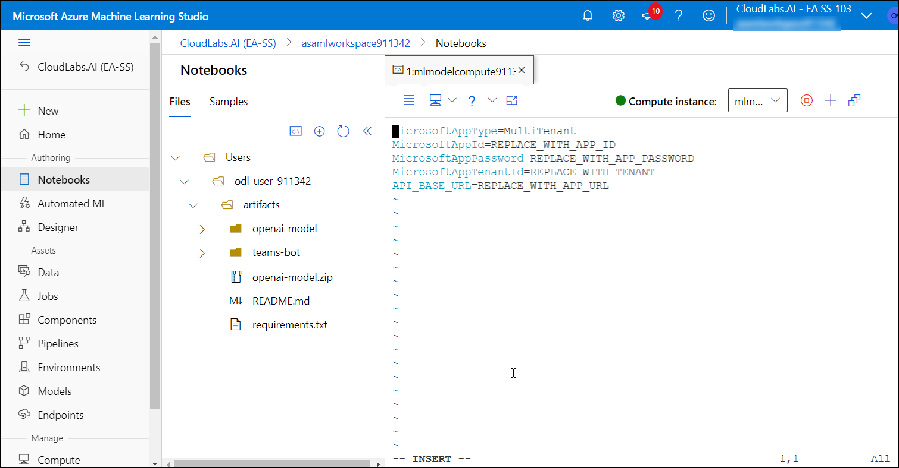
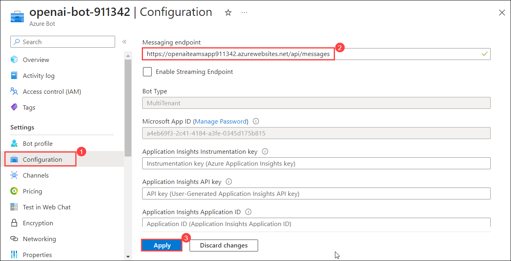
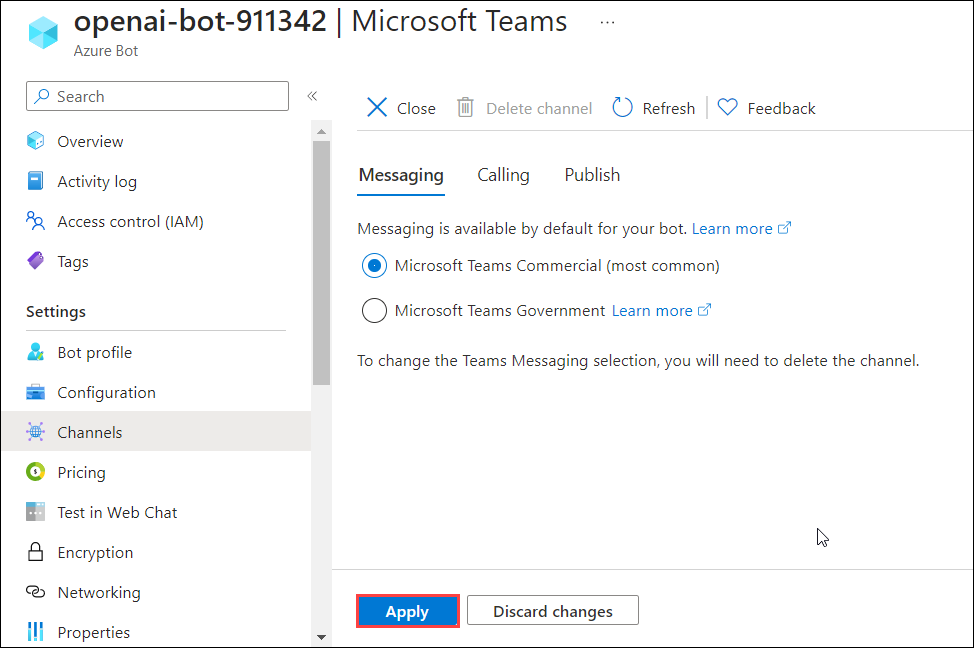
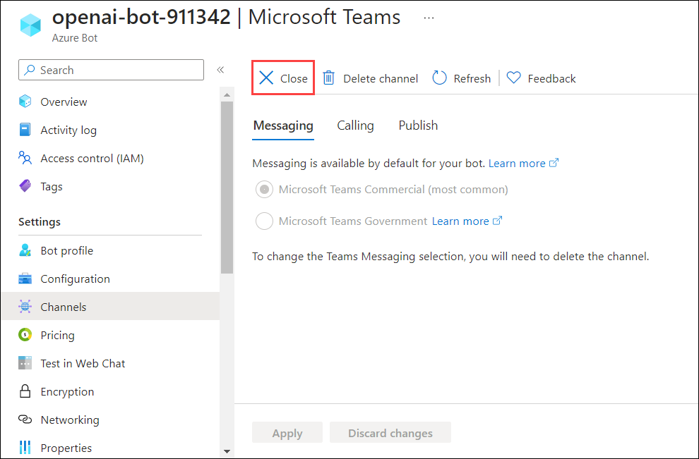
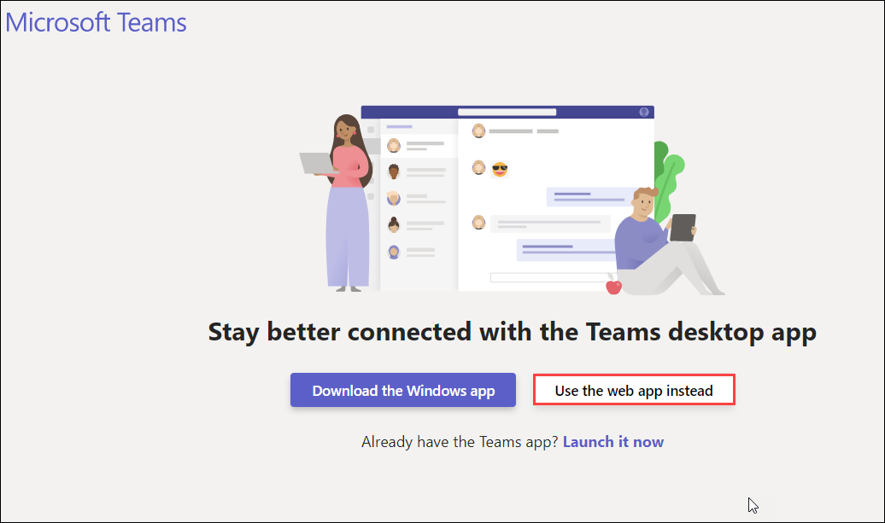

## Lab 3. Deploying the chatbot on Azure Bot Service and Azure App Service.


### Task 1 : Explore the chatbot codebase to understand user journey and dialogue development


### Task 2 : Update the configuration file with newly generated credentials


1. Navigate back to the Azure machine learning studio, and open a new terminal session.

   
   
1. Run the below commands in the terminal session:

   ```
   cd artifacts/teams-bot
   ```
   
   ```
   vim .env
   ```
   
   

1. Now you will navigating to the editor window, press **i** to get into the **insert mode**.

   
    
1. Replace the values in the **.env** file then click on **esc** followed by **:wq**.

    
    

### Task 3 : Deploy the chatbot on Azure Bot Service and Azure App Service

1. Within the terminal window run the below mentioned command to create zip folder.

   ```
   zip -r teams-bot.zip .
   ```
   > **Note :** Wait for 15-20 min till the command run successfully.

1. Now, run the below command after updating the `<DID>` with the value **<inject key="DeploymentID" enableCopy="false"/>**.

   ```
   az webapp deploy --resource-group ODL-AzureAI-MS-<DID> --name openaiteamsapp<DID> --src-path teams-bot.zip --type zip
   ```
   
1. After running the command successfully, copy the app URL in a notepad. You will be using it in coming tasks.

   
   

### Task 4: Publish the chatbot on Microsoft Teams channel using a manifest file

1. Navigate back to Azure portal and from the Overview page of resource group select Azure Bot **openai-bot-<inject key="DeploymentID" enableCopy="false"/>**.

    
    
1. On Azure bot page, follow the below given instructions:

    - Click on  **Configuration (1)**
    - Message endpoint : Enter **httsp://openaiteamsapp<inject key="DeploymentID" enableCopy="false"/>.azurewebsites.net/api/messages**
    - Click on **Apply (3)**

    

1. Click on **Channels (1)** and scroll down to Available channels and select **Microsoft Teams (2)**.

    
    
1. Check the box next to **I agree to the Microsoft Channel Publication Terms and the Microsoft Privacy Statements for my deployment to the Microsoft Teams channels** and click on  **Agree (2)**.

    
    
1. Leave eveything as default on the Microsoft Teams page and click on **Apply**.

    
    
1. Once the changes are applied succesfully, click on **Close**.

    
    
1. You can view the Microsoft Teams under Channels. Now click on **Open in Teams** URL to open the application.

    
    
1. On **Microsoft Teams** window, select **Use web app instead**.

    
    
1. 
