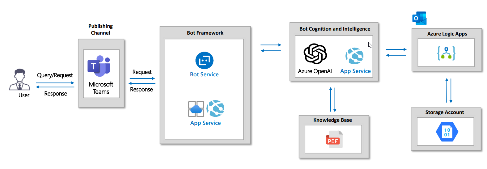

# Azure OpenAI Workshop
## Empowering Knowledge Workers using Azure OpenAI & Microsoft Teams Bot (ITSM)

Welcome to the Azure OpenAI workshop! In this workshop, you will learn how to use the Azure OpenAI service to create an AI powered solution. You will get hands-on experience with the latest AI technologies and will learn how to use Azure OpenAI API.

## Structure
- teams-bot
- openai-model
  - data
  - notebooks
  - flask-app
  - outputs
  - config.py
  - create-services.py
  - requirements.txt
  - README.md

  • OpenAI and GPT-3 have immense potential to transform various industries 
  and fields by automating tasks and generating human-like language. 
  
  • Quality and availability of data are crucial for successful implementation of 
  OpenAI and GPT-3. 
  
  • To avoid potential risks and ethical concerns, it's important to carefully 
  evaluate the data inputs and outputs of OpenAI and GPT-3, as well as 
  potential biases in the data. 
  
  • Experimentation and iteration are key to identifying the best use cases and 
  implementation strategies for Azure OpenAI.
  
  • Continual learning and exploration are necessary to stay informed about the 
  latest developments in the field and to make the most of OpenAI and GPT-3. 
  There are various resources available for continued learning, such as online 
  courses, documentation, and community forums. 
  
OpenAI's advanced language processing capabilities can greatly benefit ITSM use cases for knowledge workers. By integrating OpenAI's natural language
processing (NLP) models, ITSM systems can better understand and respond to queries, resulting in improved efficiency and effectiveness. Additionally,
OpenAI's AI-powered chatbots can provide real-time support and guidance, allowing IT staff to prioritize more complex tasks.

 
 
## Exercise 1. Leveraging an OpenAI model to create extract data and create embeddings.
  - Install all the required libraries using requirements.txt file
  - Update the configuration file with newly generated credentials 
  - Experiment with notebooks to explore data and model 
  - Review all the modules

## Exercise 2. Deploying the model using Flask framework locally and on Azure App Service. 
  - Deploy the model by running the Flask wrapper locally
  - Test the locally-deployed API with specified request/response formats
  - Deploy the model on Azure App Service
  - Test the cloud-deployed API with specified request/response formats

## Exercise 3. Deploying the chatbot on Azure Bot Service and Azure App Service. Setting up Email Automation Workflow on Azure Logic.
  - Explore the chatbot codebase to understand user journey and dialogue development 
  - Update the configuration file with newly generated credentials 
  - Deploy the chatbot on Azure Bot Service and Azure App Service
  - Publish the chatbot on Microsoft Teams channel using a manifest file
  - Add more knowldge base documents using Azure Logic Apps.

